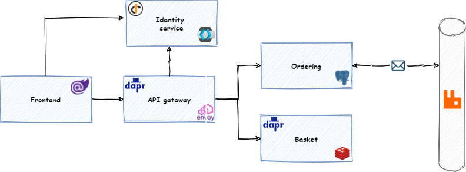

## .NET Microservice Reference Application 


[](https://codecov.io/gh/jbw/TooBigToFailBurgerShop)

### Feature highlights
* .NET 5
* DDD
* CQRS
* Event sourcing
* Distributed tracing
* Distributed transactions
* Idempotency
* Saga pattern
* Outbox pattern
* NRTs enabled
* Dapr



### Migrations

[Follow migration instructions](src/services/Ordering/Migrations/)

### Links

**Application**
* [Shop frontend](http://localhost:16968/)
* [Orders API](http://localhost:10000/api/orders)
* [Basket API](http://localhost:10000/api/basket)
 
**Tracing**
* [Jaeger](http://localhost:16686/)

**Logging**
* [Seq](http://localhost:8033)

**Databases**
* [pgAdmin](http://localhost:6541)
* [Mongo Express](http://localhost:8081)
  
**Messaging**
* [RabbitMQ management UI](http://localhost:15672)

**Dapr**
* [Dashboard](http://localhost:8034)

**Swagger**
* [Orders API](http://localhost:16969/swagger/index.html)
* [Basket API](http://localhost:16970/swagger/index.html)

### Running tests

Start the application using docker-compose and run tests. 

```
cd src
```

```
docker network create burgers.network && docker-compose -f docker-compose.yml -f docker-compose.override.yml up
```

```
dotnet test /p:CollectCoverage=true TooBigToFailBurgerShop.sln
```
